# Scheduler, AKA Dagster


## About

The following is a description of the steps and requirements for
building and deploying the docker based workflow implemented in 
dagster.

### Overview

The image following provides a broad overview of the elements that 
are loaded in to the Docker orchestration environment.  This is a very 
basic view and doesn't present any scaling or fail over elements.  

The key elements are:

* sources to configuration  to load into the Gleaner and Nabu tools, and push to the triplestore. These are now stored in
an s3 location
  * gleaner configuration. a list of sources to load. (NOTE: This is also a docker config that needs to be updated to mactch to make things work)
  * tenant configuration. a list communities, and which sources they load
* The Dagster set which loads three containers to support workflow operations
* The Gleaner Architecture images which loads three or more containers to support 
  * s3 object storage
  * graph database (triplestore)
  * headless chrome for page rendering to support dynamically inserted JSON-LD
  * any other support packages like text, semantic or spatial indexes


### WORKFLOWS

There are three workflows
* ingest works to load sources
* tasks weekly task
* ecrr - loads Earthcube Resource Registry


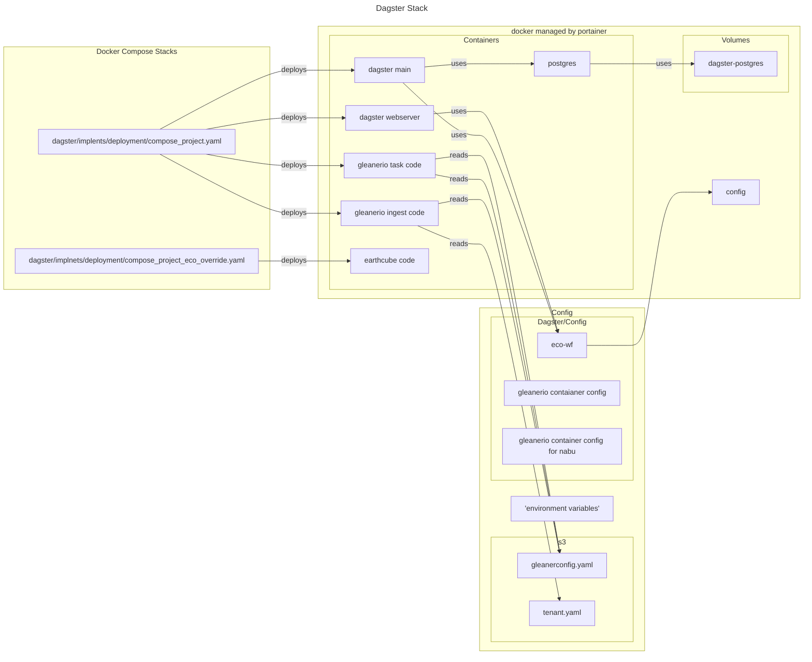
#### basic deployment

1. information for environment variables is created
2. The configuration files are created and loaded to s3, and docker/config
2. a docker stack is created, and the environment variables are added.
3. portainer deploys containers
4. when ingest and tasks are executed, they read


#### Ingest Workflow
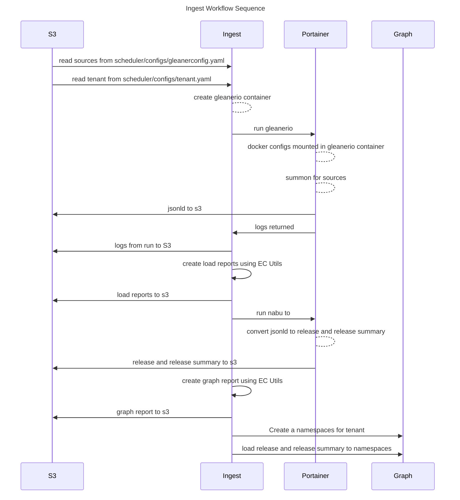

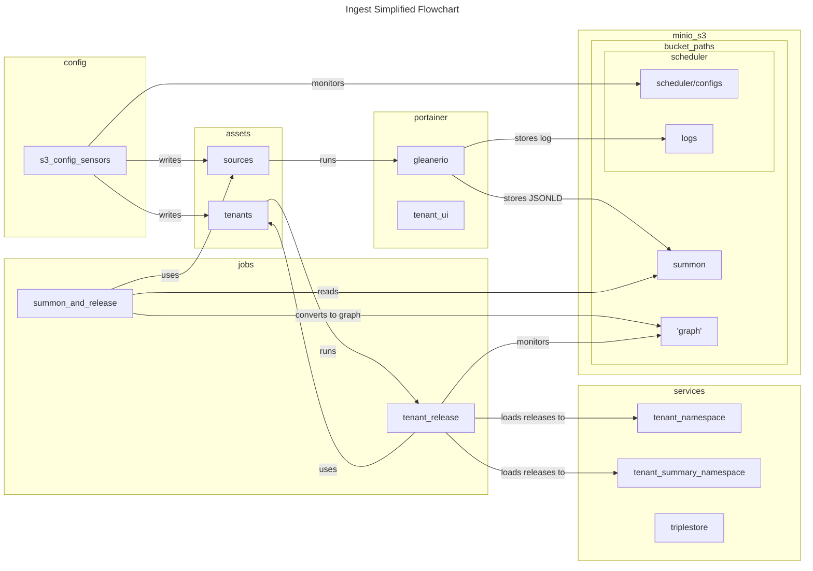

#### Task workflows
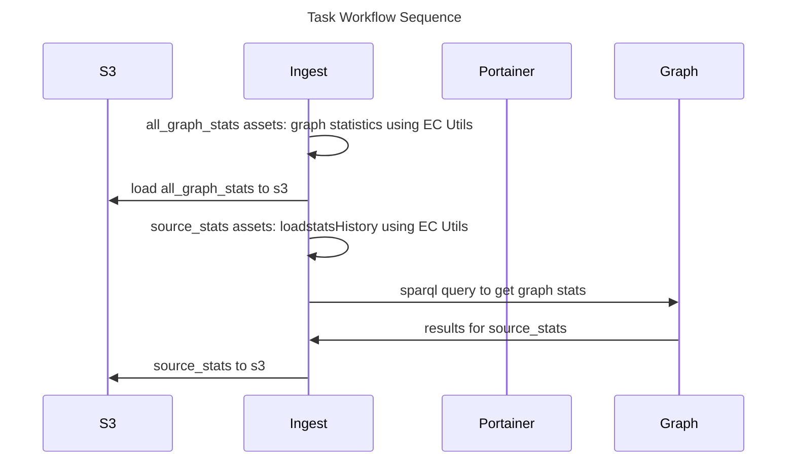


## Steps to build and deploy

The deployment can be tested locally. You can setup a services stack in docker to locally test, or use existing 
services.

The production 'containers' dagster, gleaner, and nabu are built with a github action. You can also use  a makefile.

This describes the local and container deployment
We use portainer to manage our docker deployments.
## Server Deployment. 
 [Production example for Earthcube](eco_deploy.md) 

## DEVELOPER Pycharm --  Run local with **remote** services
You can test components in pycharm. Run configurations for pycgharm  are in runConfigurations (TODO: Instructions)
use the [ENVFIle plugin.](https://plugins.jetbrains.com/plugin/7861-envfile) 
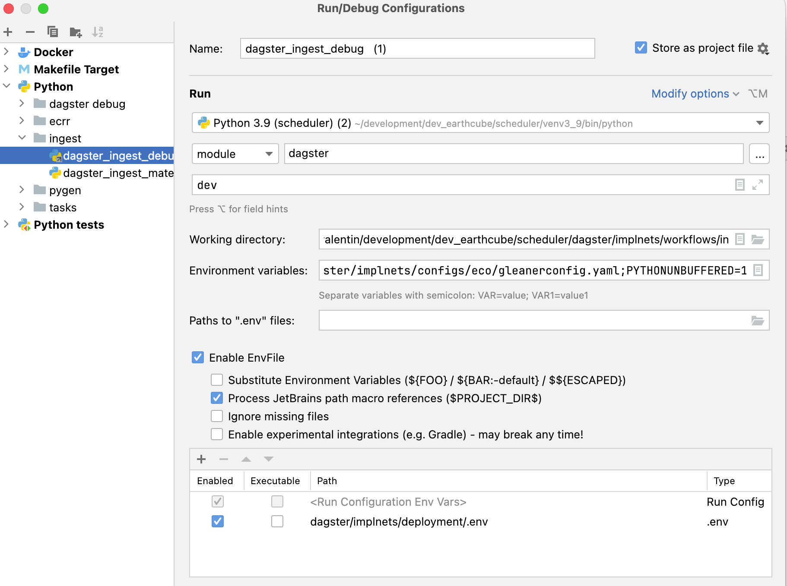
1. move to the  implnets/deployment directory
2. copy the envFile.env to .env [see](#environment-files)  use the [ENVFIle plugin.](https://plugins.jetbrains.com/plugin/7861-envfile)
3. edit the entries to point at Geocodes services:
   * minio/s3 - oss.geocodes-aws-dev.earthcube.org
   * blazegraph graph.geocodes-aws-dev.earthcube.org
   * container deployment portainer.geocodes-aws-dev.earthcube.org
4. edit configuration files in implnets/configs/PROJECT (aka eco): gleanerconfig.yaml, tenant.yaml
5. upload configuration implnets/configs/PROJECT (aka eco) to s3 scheduler/configs: gleanerconfig.yaml, tenant.yaml
4. run a Pycharm runconfig 
   * eg _dagster_ingest_debug_
4. go to http://localhost:3000/
6. you can [test the schedules](#test-schedules) 

## full stack test Run local with remote services
This will deploy a set of containers to your local docker.
(this needs work)
1. move to the implnets/deployment directory
2. copy the envFile.env to .env [see](#environment-files)use the [ENVFIle plugin.](https://plugins.jetbrains.com/plugin/7861-envfile) [see](#environment-files)  use the [ENVFIle plugin.](https://plugins.jetbrains.com/plugin/7861-envfile) 
3. edit the entries.
4. edit configuration files in implnets/configs/PROJECT (aka eco) to s3: gleanerconfig.yaml, tenant.yaml
5. upload configuration implnets/configs/PROJECT (aka eco) to scheduler/configs s3: gleanerconfig.yaml, tenant.yaml
4. for local, `./dagster_localrun.sh`
5. go to http://localhost:3000/

To deploy in portainer, use the deployment/compose_project.yaml docker stack.

### docker compose Configuration:
there are configuration  files that are needed.
They are installed in two places:
* as docker configs
* as scheduler configs in S3
* 
**Note:** env(variable). These are environment variables substituted in the docker compose files.
 
NOTE: the (gleaner/nabu) configs still need to be mounted in the containers executing gleaner and nabu

| file               | local                                    |                                                      | note                                    |
|--------------------|------------------------------------------|------------------------------------------------------|-----------------------------------------|
| workspace          | configs/PROJECT/worksapce.yaml           | dockerconfig: env(GLEANERIO_DOCKER_WORKSPACE_CONFIG) | docker compose: used by dagster         |
| gleanerconfig.yaml | configs/PROJECT/gleanerconfig.yaml       | s3:{bucket}/scheduler/configs/gleanerconfigs.yaml    | ingest workflow needs to be in minio/s3 
| tenant.yaml        | configs/PROJECT/tenant.yaml              | s3:{bucket}/scheduler/configs/tenant.yaml            | ingest workflow needs to be in minio/s3 
| dagster.yaml       | dagster/implnets/deployment/dagster.yaml | docker config:  env(GLEANERIO_DOCKER_DAGSTER_CONFIG) | docker compose: used by dagster  
| gleanerconfig.yaml | configs/PROJECT/gleanerconfig.yaml       | docker config: env (GLEANERIO_DOCKER_GLEANER_CONFIG) | mounted in gleaner docker container     
| nabuconfig.yaml | configs/PROJECT/nabuconfig.yaml          | docker config: env (GLEANERIO_DOCKER_NABU_CONFIG)    | mounted in gleaner docker container     


(NOTE: This is also a gleaner config (below in runtime configuration) that needs to be updated to match to make things work)

[Docker Configs for gleanerio containers ](https://github.com/earthcube/scheduler/issues/106) are still needed:

| file                | local                                                     | docker config | note                 |
|---------------------|-----------------------------------------------------------|---------------|----------------------|
| gleanerconfig.yaml  | configs/PROJECT/gleanerconfigs.yaml                       | env (GLEANERIO_DOCKER_GLEANER_CONFIG)        | mounted in container |
| nabuconfig.yaml | configs/PROJECT/nabuconfigs.yaml                          | env (GLEANERIO_DOCKER_NABU_CONFIG)        |   mounted in container                   |

3) when the containers are running in a  stack, on portainer, there will need to
   be updated by pulling from dockerhub. The ENV variables may need to be updated for the CONTAINER*_TAG


## Runtime configuration

### upload to an s3 bucket

| file               | local                                             |  | note                                  |
|--------------------|---------------------------------------------------| ------ |---------------------------------------|
| gleanerconfig.yaml | s3:{bucket}/scheduler/configs/gleanerconfigs.yaml | | ingest workflow configs read from minio/s3  
| tenant.yaml        | s3:{bucket}/scheduler/configs/enant.yaml          |  | ingest workflow configs read from in minio/s3  

### updating config
You can update a config, and a sensor should pick up the changes.
1) Upload changed file to s3
   2) note, if this is a new source, you need to update the  docker config, by cloning, and editing the file. Then change the variable env (GLEANERIO_DOCKER_GLEANER_CONFIG) to that name
2) go to overview, 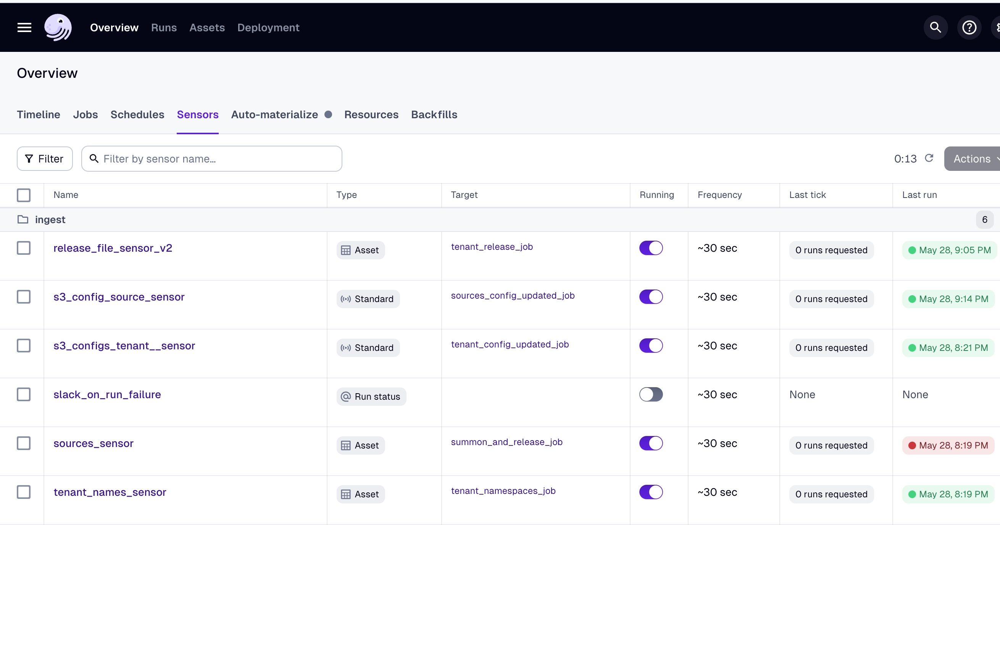
3) go to  s3_config_source_sensor  for gleanerconfig.yaml changes, and s3_config_tenant_sensor for tenant.yaml changes
 .
4) at some point, a run should occur.  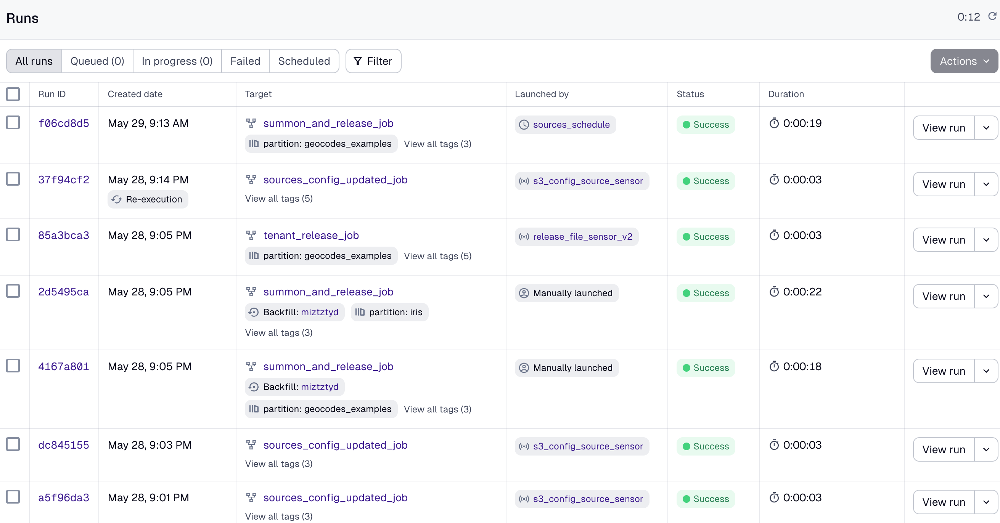.
5) then go to the sources_sensor, or tenant sensor 
if job does not run, you can do a backfill.
#### new sources:
6)  so to job tab, and run summon_and_release with the 'partitions' aka 'sources' that are recent.
7) click materialize_all, and in the backfill dialog be sure only the added partition is selected.  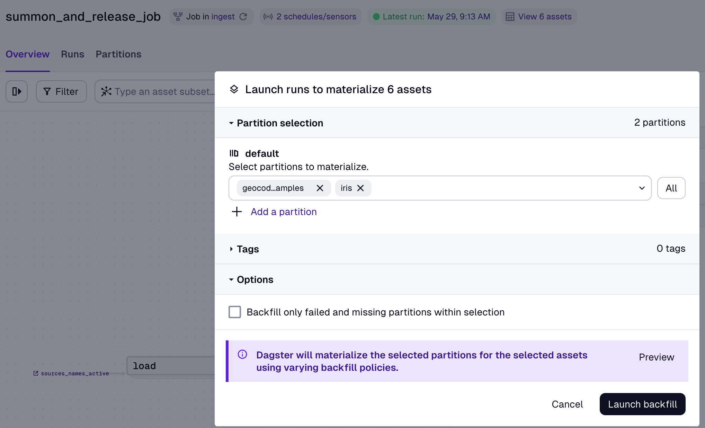.
8) go to runs, and see that a job with a partition with that name is queued/running
9) run tenant_release_job with same partition name to load data to tenants
###
#### new tenants:
There are two jobs that need to run to move data to a tenant. (third will be needed for UI)
6)  so to job tab, and run tenant_namespaces_job with the 'partitions' aka 'tenant' that are recent.'
7) click materialize_all, and be sure only the added partition is selected
8) go to runs, and see that a job with a partition with that name is queded,/running
6)  so to job tab, and run tenant_release_job with the 'partitions' aka 'sources' for that tenant
7) click materialize_all, The data will be pushed to all tenant namespaces

## test schedules
 
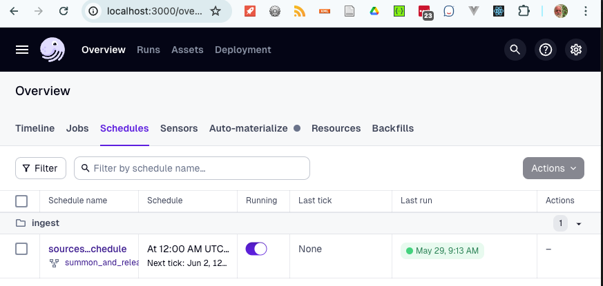
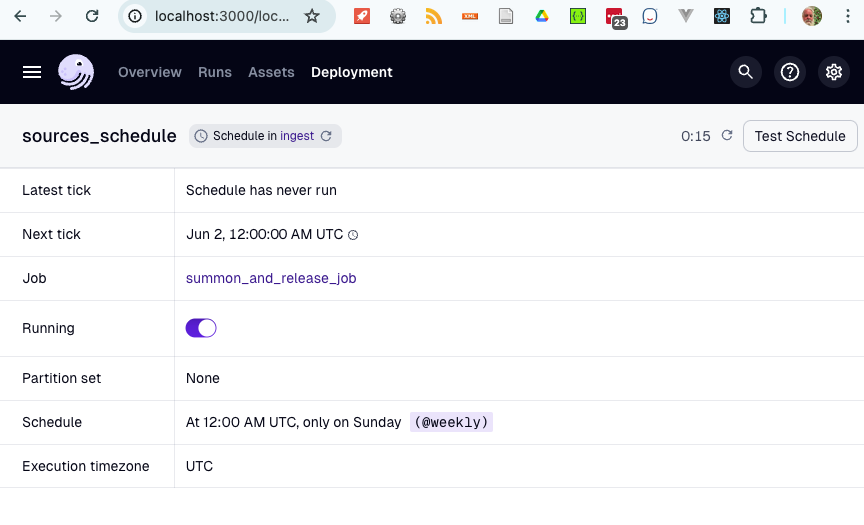
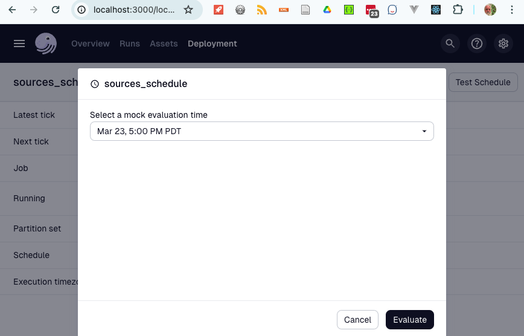
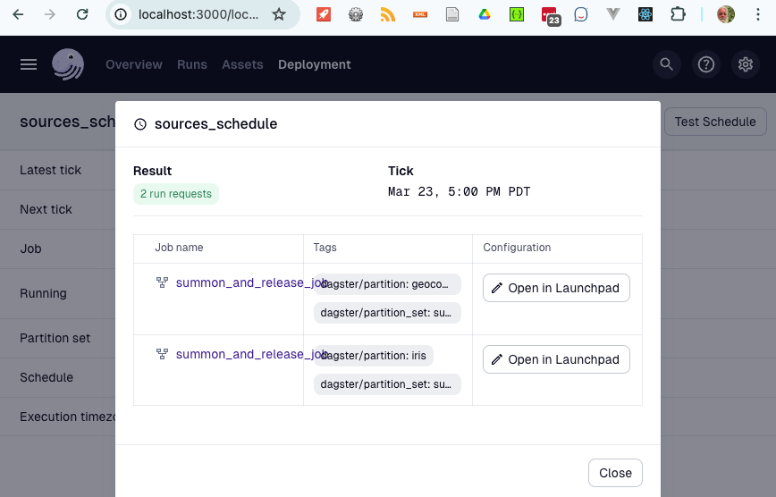
### Environment files

1) cp deployment/envFile.env .env
2) edit
3) `export $(cat .env | xargs)`
export $(cat .env | xargs)
```yaml
######
# Nabu and Gleaner configs need to be in docker configs
## docker config name GLEANER_GLEANER_DOCKER_CONFIG
## docker config name GLEANER_NABU_DOCKER_CONFIG
#        suggested DOCKER_CONFIG NAMING PATTERN (nabu||gleaner)-{PROJECT}
########
GLEANERIO_DOCKER_GLEANER_CONFIG=gleaner-eco
GLEANERIO_DOCKER_NABU_CONFIG=nabu-eco

# ###
# workspace for dagster
####
GLEANERIO_WORKSPACE_CONFIG_PATH=/usr/src/app/workspace.yaml
GLEANERIO_DOCKER_WORKSPACE_CONFIG=workspace-eco


DEBUG_CONTAINER=false

#### HOST
#  host base name for treafik. fixed to localhost:3000 when using  compose_local.
HOST=localhost
# Applies only to compose_project.yaml runs

#  modify SCHED_HOSTNAME is you want to run more than one instance
#    aka two different project havests for now.
SCHED_HOSTNAME=sched

GLEANERIO_DOCKER_CONTAINER_WAIT_TIMEOUT=300
# debugging set to 10 - 30 seconds


PROJECT=eco
#PROJECT=iow
#PROJECT=oih
# tags for docker compose
CONTAINER_CODE_TAG=latest
CONTAINER_DAGSTER_TAG=latest

PROTOCOL_BUFFERS_PYTHON_IMPLEMENTATION=python
# port is required: https://portainer.{HOST}:443/api/endpoints/2/docker/
GLEANERIO_DOCKER_URL=https://portainer.{HOST}:443/api/endpoints/2/docker/
GLEANERIO_PORTAINER_APIKEY=
# if running dagster-dev, then this needs to be set ,
#       defaults to "/scheduler/gleanerconfig.yaml" which is path to config mounted in containers
# when debugging generated code "../../../configs/eco/gleanerconfig.yaml"
# when debugging code in workflows "../../configs/eco/gleanerconfig.yaml"
GLEANERIO_DAGSTER_CONFIG_PATH=../../../configs/eco/gleanerconfig.yaml

# Network
GLEANERIO_DOCKER_HEADLESS_NETWORK=headless_gleanerio

### GLEANER/NABU Dockers
GLEANERIO_GLEANER_IMAGE=nsfearthcube/gleaner:dev_ec
GLEANERIO_NABU_IMAGE=nsfearthcube/nabu:dev_eco

##
# path where configs are deployed/mounted
####
GLEANERIO_GLEANER_CONFIG_PATH=/gleaner/gleanerconfig.yaml
GLEANERIO_NABU_CONFIG_PATH=/nabu/nabuconfig.yaml
###
#path in s3 for docker log files
GLEANERIO_LOG_PREFIX=scheduler/logs/

GLEANERIO_MINIO_ADDRESS=
GLEANERIO_MINIO_PORT=80
GLEANERIO_MINIO_USE_SSL=false
GLEANERIO_MINIO_BUCKET=
GLEANERIO_MINIO_ACCESS_KEY=
GLEANERIO_MINIO_SECRET_KEY=
GLEANERIO_HEADLESS_ENDPOINT=http://headless:9222

# just the base address, no namespace https://graph.geocodes-aws-dev.earthcube.org/blazegraph
GLEANERIO_GRAPH_URL=https://graph.geocodes-aws.earthcube.org/blazegraph
GLEANERIO_GRAPH_NAMESPACE=mytest

# optional: GLEANERIO_GRAPH_SUMMARY_ENDPOINT defaults to GLEANERIO_GRAPH_URL
#GLEANERIO_GRAPH_SUMMARY_ENDPOINT=https://graph.geocodes-aws-dev.earthcube.org/blazegraph
GLEANERIO_GRAPH_SUMMARY_NAMESPACE=mytest_summary
GLEANERIO_GRAPH_SUMMARIZE=True

# where are the gleaner and tennant configurations
GLEANERIO_CONFIG_PATH="scheduler/configs/"
GLEANERIO_TENANT_FILENAME="tenant.yaml"
GLEANERIO_SOURCES_FILENAME="gleanerconfig.yaml"

# ECO Custom variables for ecrr
ECRR_GRAPH_NAMESPACE=ecrr
ECRR_MINIO_BUCKET=ecrr

# only a public slack channel works. DV has no permissions to create a new channel
#SLACK_CHANNEL="#production_discussion"
SLACK_CHANNEL="#twitterfeed"
SLACK_TOKEN=

```


## Appendix

### Portainer API setup

You will need to setup Portainer to allow for an API call.  To do this look 
at the documentation for [Accessing the Portainer API](https://docs.portainer.io/api/access)

## Notes


### Handle Multiple Organizations

thoughts... 

* Each organization can be in a container with its own code workflow. 
   *  in the workflows directory: `dagster project projectname`
* If we can standardize the loading and transforming workflows as much as possible, then the graph loading workflows 
 should be [standardized](https://github.com/earthcube/scheduler/issues/142). We could just define an additional container in a compose file, and add that to the workflows

```
load_from:
#      - python_file:
#          relative_path: "project/eco/repositories/repository.py"
#          location_name: project
#          working_directory: "./project/eco/"
#      - python_file:
#          relative_path: "workflows/ecrr/repositories/repository.py"
#          working_directory: "./workflows/ecrr/"
      # module starting out with the definitions api
     # - python_module: "workflows.tasks.tasks"

      - grpc_server:
            host: dagster-code-tasks
            port: 4000
            location_name: "tasks"
      - grpc_server:
            host: dagster-code-eco-ingest
            port: 4000
            location_name: "ingest"
      - grpc_server:
            host: dagster-code-ios-ingest
            port: 4000
            location_name: "ingest"
      - grpc_server:
            host: dagster-code-eco-ecrr
            port: 4000
            location_name: "ecrr"
```

* to add a container, you need to edit the workflows.yaml in an organizations configuration

## Cron Notes

A useful on-line tool:  [https://crontab.cronhub.io/](https://crontab.cronhub.io/)

```
0 3 * * *   is at 3 AM each day

0 3,5 * * * at 3 and 5 am each day

0 3 * * 0  at 3 am on Sunday

0 3 5 * *  At 03:00 AM, on day 5 of the month

0 3 5,19 * * At 03:00 AM, on day 5 and 19 of the month

0 3 1/4 * * At 03:00 AM, every 4 days
```


## Indexing Approaches

The following approaches

* Divide up the sources by sitemap and sitegraph
* Also divide by production and queue sources

The above will result in at most 4 initial sets.

We can then use the docker approach

```
./gleanerDocker.sh -cfg /gleaner/wd/rundir/oih_queue.yaml  --source cioosatlantic
```

to run indexes on specific sources in these configuration files.  


