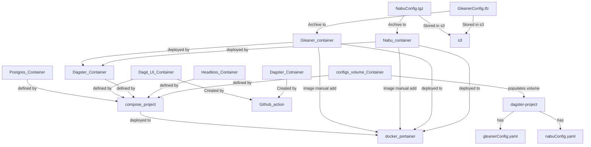

# ECO Scheduler Notes

!!! Note
    these will need to become the gleanerio scheduler documentation. 
    for now these are rough. Images and graphics need to be loaded

## Deploy

### Deploy Dagster in Portainer
You will need to deploy dagster contiainers to portainer, for a docker swarm
0. get the portatinaer url, and auth token 
0.  SSH to the  make hosting the docker.

1. Pull scheduler repo
2. cd dagster/implnets/deployment
3. create a copy of envFile.env and **edit env variables**
   4. PROJECT=eco
   5. GLEANERIO_MINIO_ADDRESS ++
   6. GLEANERIO_GRAPH_URL, GLEANERIO_GRAPH_NAMESPACE
   7. GLEANERIO_DOCKER_URL, GLEANERIO_PORTAINER_APIKEY
   8. SCHED_HOSTNAME defaults to sched
5. as noted as noted in (Compose, Environment and Docker API Assets), deploy the configuration to s3. 
6. ~~create network and volumes needed `dagster_setup_docker.sh`~~
7. manually add configs
   8. gleaner-{project}
   9. nabu-{project}
   10. workspace-{project}
   11. tenant-{project}
   11. dagster from:dagster/implnets/deployment/dagster.yaml
7. add configs to S3/Minio. 
   8. scheduler/configs/gleanerconfig.yml
   9. scheduler/configs/tenant.yml
8. create a stack,
   9. gtibub repo: https://github.com/earthcube/scheduler.git
   10. branch: dev
   11. compose files: dagster/implnets/deployment/compose_project.yaml
   12. additional path: dagster/implnets/deployment/compose_project_eco_override.yaml

