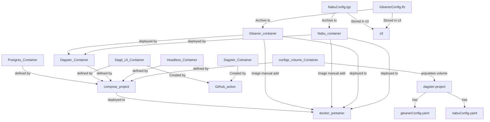

# ECO Scheduler Notes

!!! Note
    these will need to become the gleanerio scheduler documentation. 
    for now these are rough. Images and graphics need to be loaded



## Deploy

### Deploy Dagster in Portainer
You will need to deploy dagster contiainers to portainer, for a docker swarm

1. Pull scheduler repo
2. cd dagster/implnets/deployment
3. create a copy of envFile.env and edit env variables
4. pull images for nabu and gleaner
   ```GLEANERIO_GLEANER_IMAGE=nsfearthcube/gleaner:latest``` and 
   ```GLEANERIO_NABU_IMAGE=nsfearthcube/nabu:latest```
5. as noted as noted in (Compose, Environment and Docker API Assets), deploy the configuration to s3. 
6. create network and volumes needed `dagster_setup_docker.sh`
7. create a stack, from compose_project.yaml, with the env variables you set


### Deploy Local

this runs a local compose

1. cd dagster/implnets
2. ```make eco-clean```and ```make eco-generate```
3. cd dagster/implnets/deployment 
4. run dagster_setup_docker.sh 
5. run dagster_localrun.sh

## Implementation network builder

The work for building the dagster containers for a given implementation network starts in 
the directory ```scheduler/dagster/implnets```.  This has been automated for CI
For local development, At this time most of this can be driven by
the Makefile

### AUTOMATED CI Build
The containers are now built by a github action, and stored in the
[nsf earhtcube dockerhub](https://hub.docker.com/repositories/nsfearthcube)

1. Make sure your gleanerconfig.yaml file is in the configs/NETWORK directory where
   NETWORK is your implmentation network like eco, iow, etc. 
2. if on a branch that you want to build, be sure the branch is in to [github action](../.github/workflows/contanerize.yaml)
3. increment VERSION, and commit. 
4. watch [actions](https://github.com/earthcube/scheduler/actions)

### LOCAL DEVELOPMENT
1. Make sure your gleanerconfig.yaml file is in the configs/NETWORK directory where NETWORK is your implmentation network like eco, iow, etc. 
2. Check the VERSION file and make sure it has a value you want in it to be tagged to the containers.
3. ```make eco-clean```  will remove any existing generated code from the ./generatedCode/implnet-NETWORK directory
4. ```make eco-generate``` will build the code new.  Set the -d N in the makefile to a value N that is the number
   of days you want the runs to cycle over.  So 30 would mean they run once every 30 days.  If you want some providers
   to index at different rates you currently need to go in and edit the associated provider _schedules_ file editing the
   line ```@schedule(cron_schedule="0 12 * * 6", job=implnet_job_amgeo, execution_timezone="US/Central")``` with a 
   cron value you want.
5. ```make eco-build``` builds the Docker images following the build file ./build/Docker file.  Note this uses the 
   command line argument ```--build-arg implnet=eco``` to set the implementation NETWORK so that the correct build code 
   from _generatedCode/NETWORK_ is copied over


## Compose, Environment and Docker API Assets

1. You will need the (or need to make) the portainer access token 
    from your https://portainer.geocodes-aws-dev.earthcube.org/#!/account
2. You will need a valid Gleaner configuration file named gleanerconfig.yaml and a nabu config named nabuconfig.yaml 
3. You will need the schema.org context files places in a directory _assets_  get each of the http and https versions
   1. ```wget https://schema.org/version/latest/schemaorg-current-https.jsonld```
   2. ```wget https://schema.org/version/latest/schemaorg-current-http.jsonld```
4. Generate the archive files for Gleaner and Nabu.  Note the path to the context files should map with what is in the configuration files
   1. ```tar -zcf ./archives/NabuCfg.tgz ./nabuconfig.yaml ./assets```
   2. ```tar -zcf ./archives/GleanerCfg.tgz ./gleanerconfig.yaml ./assets```
5. The archives .tgz files named _NabuCfg.tgz_ and _GleanerCfg.tgz_ need to be copied to the schedule prefix
   in your bucket used for Gleaner
   1. ```mc cp GleanerCfg.tgz NabuCfg.tgz  gleaner/scheduler/configs```
   2. Make sure GLEANERIO_NABU_ARCHIVE_OBJECT and GLEANERIO_GLEANER_ARCHIVE_OBJECT reflect this location in the .env file
6. Next you will need to build the scheduler containers for your implementation network. Push these containers
   to your container registry of choice and make sure the values are set in the .env file and that
   the containers are available to Portainer or will get pulled on use.   These are the image files in the 
   compose file and also the images notes in the environment variables GLEANERIO_GLEANER_IMAGE and GLEANERIO_NABU_IMAGE
   in the .env file.


At this point you are ready to move to your Docker or Portainer environment and deploy the 
compose and environment files.  

## Notes

1. I do not have the API call to ensure/check/pull and image used by the API, so these images need to be 
   pulled down manually at this time.  These are the images noted by the .env files at 
   ```GLEANERIO_GLEANER_IMAGE=nsfearthcube/gleaner:latest``` and 
   ```GLEANERIO_NABU_IMAGE=nsfearthcube/nabu:latest```
