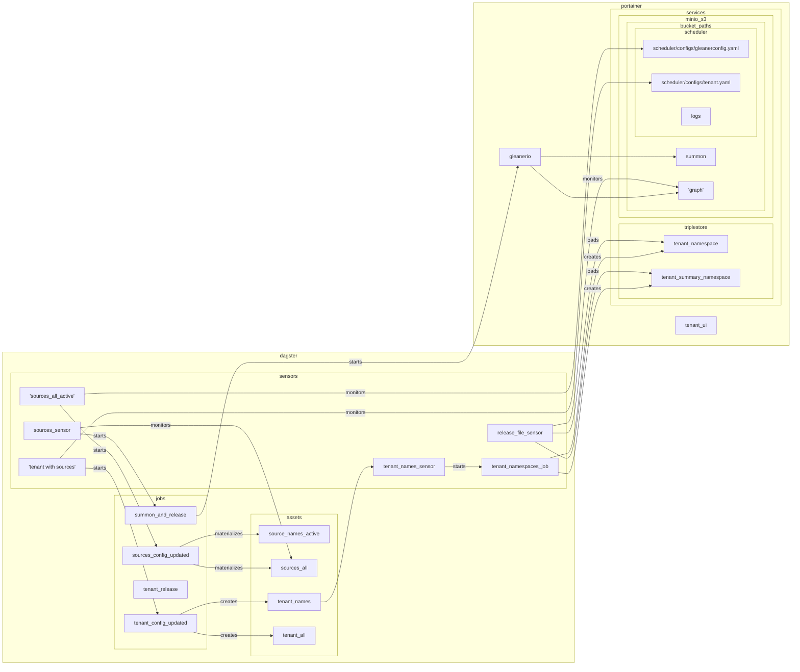

# ingest workflow

This is found in implnets/workflows/ingest

```mermaid
flowchart LR
    subgraph dagster
        subgraph sensors
            s3_config_sources_sensor['sources_all_active']
            s3_config_tenant_sensor['tenant with sources']
            sources_sensor
            release_file_sensor
            tenant_names_sensor
            tenant_namespaces_job
        end
        subgraph jobs
            summon_and_release
            sources_config_updated
            tenant_release
            tenant_config_updated
        end
        subgraph assets
            source_names_active
            sources_all
            tenant_names
            tenant_all
        end

        
    end
    s3_config_sources_sensor--monitors --> sources_config
    s3_config_tenant_sensor--monitors  -->tenant_config 
    s3_config_sources_sensor--starts-->sources_config_updated
    sources_config_updated--materializes-->source_names_active
    sources_config_updated--materializes-->sources_all
    s3_config_tenant_sensor--starts-->tenant_config_updated
    tenant_config_updated--creates-->tenant_names
    tenant_config_updated--creates-->tenant_all
    sources_sensor--monitors-->sources_all
    sources_sensor--starts-->summon_and_release
    summon_and_release--starts--> gleanerio
    gleanerio-->summon
    gleanerio-->graph_path
    tenant_names-->tenant_names_sensor
    tenant_names_sensor--starts-->tenant_namespaces_job
    tenant_namespaces_job--creates--> tenant_namespace
    tenant_namespaces_job--creates-->tenant_summary_namespace
    release_file_sensor--monitors-->graph_path
    release_file_sensor--loads-->tenant_namespace
    release_file_sensor--loads-->tenant_summary_namespace
    
    subgraph portainer
      gleanerio 
      tenant_ui
      subgraph services
           subgraph triplestore
               tenant_namespace
               tenant_summary_namespace
            end
    
          subgraph minio_s3 
            subgraph bucket_paths
                subgraph scheduler
                     sources_config["`scheduler/configs/gleanerconfig.yaml`"]
                     tenant_config["`scheduler/configs/tenant.yaml`"]
                     logs
                end
                summon
                graph_path['graph']
            end
            end

         end
    end
    
   
```
